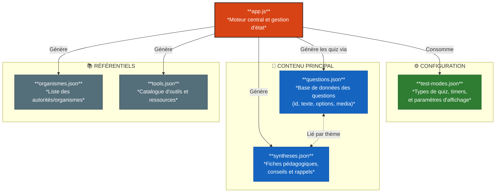

# Cyber Training - Révision TOSA


[](https://github.com/toltek-be/cyber-training/issues)


  
---  

Une application web de quiz interactive pour s'entraîner à la cybersécurité et préparer la certification TOSA.

## 🚀 Fonctionnalités

- **Modes de Test Variés** :
  - **Grand Test Complet** : 189 questions couvrant l'ensemble du programme.
  - **Test Blanc TOSA** : 50 questions équilibrées pour simuler l'examen.
  - **Modes Chronométrés** : Limite de temps ajustable (badge ⏱️) avec fin automatique du quiz.
  - **Mises en situation** : Focus sur les scénarios concrets (emails, phishing, incidents).
  - **Révision Express** : Session rapide de 20 questions aléatoires.
  - **Niveaux de difficulté** : Facile, Moyen ou Difficile pour une progression adaptée.
- **Entraînement par Thème** : 8 thèmes spécifiques (Web, Phishing, Mots de passe, RGPD, OSINT, etc.).
- **Synthèses de cours** : Plus de 20 fiches récapitulatives interactives sur des sujets variés (RGPD, IA, IoT, Cryptographie, etc.).
- **Personnalisation** : Thème graphique unique (**SecOps**).
- **Support Multimédia** : Intégration d'images et de vidéos pour illustrer les questions, avec fonction de zoom (modale) pour les visuels.
- **Types de Questions Variés** :
  - Choix unique et multiple.
  - Vrai / Faux.
  - Texte à trous.
  - Éléments à relier (Matching).
  - Remise en ordre.
- **Correction Immédiate** : Explications détaillées pour chaque question après validation (désactivé en mode chronométré pour favoriser la rapidité).
- **Navigation Optimisée** : Passage automatique à la question suivante en mode timer et marquage des questions non répondues comme "Passées" à l'expiration du temps.
- **Progression Persistante** : Sauvegarde automatique de l'avancement dans le navigateur (`LocalStorage`).
- **Zéro Data** : Fonctionne entièrement côté client, aucune donnée personnelle n'est collectée ou envoyée à un serveur.
- **Expérience Dynamique** : Mélange aléatoire des réponses à chaque session pour éviter le par cœur visuel.
- **PWA Ready** : Installation possible sur smartphone et tablette (Manifest et icônes inclus) pour un accès rapide.
- **Ergonomie & Visuels** : 
  - **Courbes de Bézier** : Rendu fluide et esthétique des lignes de liaison (Matching).
  - **Gestion des doublons** : Plusieurs réponses à droite peuvent avoir le même libellé.
  - **Flexibilité** : Possibilité de modifier ou d'annuler une liaison par simple clic ou glissement tactile.
- **Support des Questions d'Examen** : Adaptations spécifiques pour les questions complexes du TOSA (catégorisations RGPD, etc.).

## 🛠 Installation & Développement

### Usage Simple (Utilisateur)
Aucune installation complexe n'est requise. L'application est composée de fichiers statiques (HTML, CSS, JS).

1. Clonez ou téléchargez le dépôt.
2. Ouvrez le fichier `index.html` dans n'importe quel navigateur moderne.

### Développement (Avancé)
Si vous souhaitez modifier les styles ou minifier le code, le projet utilise **Node.js** et **npm**.

1. Installez les dépendances : `npm install`
2. Lancez le build : `npm run build`

Le dossier `dist/` contiendra la version optimisée prête pour la mise en ligne.

## 📂 Structure du projet

```text
.
├── index.html          # Point d'entrée (gestion du versioning)
├── app.js              # Logique, moteur de quiz et gestion d'état
├── data/               # Ressources JSON
│   └── lang/           # Sous-répertoires par langue
│       └── fr/        
│           ├── questions.json    # Base de données des questions
│           ├── test-modes.json   # Configuration des modes
│           ├── syntheses.json    # Fiches pédagogiques
│           ├── organismes.json   # Autorités et organismes
│           ├── tools.json        # Catalogue d'outils
│           └── ui.json           # Traductions UI
├── styles/            # Feuilles de style (base & SecOps)
└── favicon/           # Ressources graphiques et manifest
````



## 🔄 Résumé des améliorations du mélange aléatoire

| Élément | Avant | Après |  
| :--- | :--- | :--- |  
| **Ordre des questions** | ❌ Toujours le même | ✅ Mélangé par quiz |  
| **Ordre des réponses** | ❌ Toujours le même | ✅ Aléatoire pour chaque question |  
| **Ordre matching (droite)** | ❌ Juste inversé | ✅ Aléatoire pour chaque question |  
| **Ordre initial "remise en ordre"** | ❌ Toujours inversé | ✅ Complètement mélangé |  
| **Doublons en matching** | ❌ Identifiants uniques stricts | ✅ Validation par libellé textuel |
| **Lignes de liaison** | ❌ Lignes droites rigides | ✅ Courbes de Bézier fluides |
| **Modes de test** | ❌ Sans limite de temps | ✅ Support du minuteur (Timer) |

- **Optimisation mobile** : Amélioration des interactions tactiles sur les types Matching/Order (Drag & Drop tactile et zones de clic élargies).


## ⚙️ Maintenance & Fiabilisation

### Format des Questions (JSON)

Chaque question dans `data/questions.json` peut inclure un champ `media` optionnel pour afficher une image ou une vidéo :

```json  
"media": {  
  "type": "image",  "src": "media/nom-du-fichier.png",  "alt": "Texte alternatif pour l'accessibilité",  "caption": "Légende affichée sous le média"}  
```  

*Note : Pour une vidéo, utilisez `"type": "video"`. Les formats supportés dépendent des capacités du navigateur (généralement MP4/WebM).*

### Architecture & Sécurité

- **Architecture** : Séparation totale entre le code (`app.js`) et les données (`.json`).
- **Sécurité** : Utilisation d'une **Content Security Policy (CSP)** stricte pour protéger l'exécution.
- **Chargement** : Utilisation de l'API `fetch` pour un chargement asynchrone et performant.
- **Encodage** : Tous les fichiers sont en **UTF-8 sans BOM**.
- **Robustesse** : Le moteur `app.js` intègre des sécurités (ex: `hashCode` sécurisé) et les questions disposent d'identifiants uniques.
- **Versioning** : Paramètre `?v=YYYY-MM-DD-X` utilisé pour forcer le rafraîchissement du cache des scripts et données.

## 🚀 TODO - Nice to Have

- **Statistiques globales** : Visualisation de la progression globale par thème.
- **Mode sombre automatique** : Bascule basée sur les préférences système.
- **Support Multilingue** : Préparation du moteur pour l'anglais/néerlandais.

## 📈 Dernières Évolutions

- **Juillet 2026** : 
    - Implémentation du **Minuteur (Timer)** pour les modes de test.
    - Ajout des **Courbes de Bézier** pour les lignes de liaison en Matching.
    - Optimisation des **interactions tactiles** (Drag & Drop).
    - Passage sous licence **MIT**.
- **Juin 2026** :
    - Refonte du moteur de mélange aléatoire.
    - Amélioration de la navigation vers les synthèses par thème.


## 📝 Licence

Ce projet est distribué sous licence **MIT** — libre à vous de l'utiliser, le modifier et le redistribuer, y compris à des fins commerciales, en conservant la mention de copyright.

Développé initialement par [Celio Miceli](https://www.linkedin.com/in/celio-miceli-57285a1b5) pour la formation CyberCitizen, puis repris et poursuivi par Toltek après la formation.